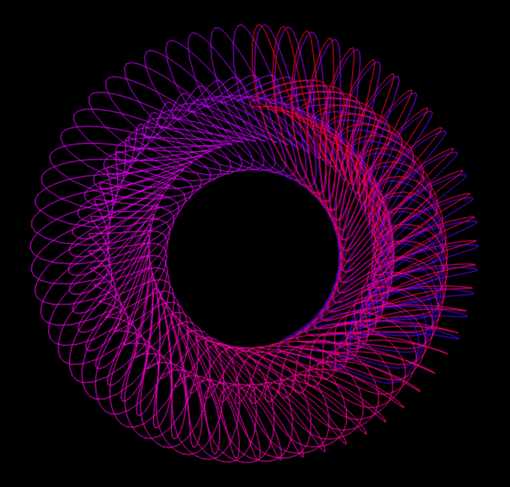

# Steve's Generative Art Scrapbook

A repo filled with generative art experiments. Please feel free to use this as inspiration for your own work, but let me know if you do anything interesting! Code released under GPL v3.0

## Getting started

```
python -m venv .venv
source .venv/bin/activate
pip install -r requirements.txt
```

## Projects

### Spirograph

Two rotating wheels orbiting a larger wheel, connected with a lever with a pen on the end. Inspired by the patterns created by Spirograph in the 80s.

Hit <space> to show / hide the mechanism

```
python spirograph.py
```



### Branches

Random branches that create offshoots as they go, terminating when hitting another line

Will keep regenerating with different branch curvature and probabilities.

```
python branches.py
```
